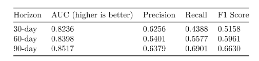

## 1. Introduction

Hospital stays are a persistent, somewhat unavoidable and a costly challenge for healthcare systems worldwide. Unplanned re-hospitalizations not only drive up healthcare costs but also negatively impact quality of care and patient satisfaction. In the United States, the Centers for Medicare and Medicaid Services (CMS) estimates that preventable re-hospitalizations cost around $26 billion annually. re-hospitalizations rates are widely used as quality metrics, influencing financial penalties and hospital rankings. Reducing these rates requires accurate, early identification of patients at high risk for re-hospitalizations so that targeted interventions can be implemented.

Traditional statistical models, while valuable for inference, often struggle to capture the complex, nonlinear patterns in large-scale clinical datasets. Machine learning (ML) methods, especially deep learning models can handle high-dimensional and heterogeneous data and offer a promising alternative to these methods.

In this work, I predicted 30-, 60-, and 90-day hospital re-hospitalizations risk using the MIMIC-IV dataset. The approach here integrates both structured features (e.g., basic patient informations, labs, ICD codes) and unstructured free-text clinical notes. The notes are transformed into dense semantic numerical representation, also referred to as embeddings, of the texts using BioBERT, enabling capture of nuanced clinical signals often missed by organized information (like numbers and categories) alone.

**Key hypothesis:** Large Language Models (LLMs), when used as representation learners, can extract clinically meaningful features from unorganized information (like numbers and categories) that improve predictive performance. A custom medical terminology based LLM like BioBert is particularly well-suited for this task, as it is pre-trained on biomedical texts and can generate numerical summary of the texts that preserve semantic and contextual meaning.

## 2. Related Work

### 2.1 Importance of Rehospital stay Risk Prediction
Prior research has demonstrated the importance of re-admit prediction for both clinical care and operational efficiency. Oh et al. (2025) showed that ML-based models using nursing data enable early identification of high-risk patients, supporting targeted interventions. Adhiya et al. (2024) emphasized the preventable nature of many re-admits and their strain on hospital resources. The Hospital re-admit Reduction Program (HRRP) financially penalizes hospitals with excessive re-admits, further incentivizing accurate prediction.   

### 2.2 LLMs as Representation Learners
Representation learning transforms raw inputs into low-dimensional numerical summary of the texts that preserve semantic and contextual meaning. Recent work (Tao et al., 2025; Ren et al., 2024) has shown that LLM numerical summary of the texts can outperform traditional encoder-only models like BERT, especially when domain-specific fine-tuning is applied. The “Surprisingly Simple” study (ICLR 2025) demonstrated that LLMs can serve as zero-shot feature extractors for both structured and unorganized information (like numbers and categories), reducing preprocessing requirements while maintaining strong performance.

## 3. How I Approached the Problem

The workflow follows four main stages:

1. **Data Exploration & Cohort Selection**
2. **Feature Engineering**
3. **Model Development**
4. **Evaluation**

### 3.1 Data Sources
I used the MIMIC-IV dataset, which contains de-identified EHR data for ICU and hospital patients. The following tables were used:

- `patients.csv`
- `hospital stays.csv`
- `diagnoses_icd.csv`
- `d_icd_diagnoses.csv`

### 3.2 Cohort Selection
I constructed a balanced group of patients to reduce basic patient information bias:

1. Start from the `hospital stays` table to access race information.
2. Map race categories into six groups: WHITE, BLACK, ASIAN, HISPANIC, OTHER, and NATIVE.
3. Randomly sample 5,000 patients from each major race category, include all NATIVE patients.
4. Merge with `patients` to include basic patient informations and mortality (`death_flag`).
5. Filter patients to age 20–80.

### 3.3 Diagnosis Data Processing
1. Extract medical diagnosis codes from `diagnoses_icd` for the selected group of patients.
2. Merge with `d_icd_diagnoses` to get long descriptions.
3. Collapse all diagnoses for a given hospital stay into a single text string.

### 3.4 Feature Engineering
I extracted:

- **Demographics:** age at hospital stay, gender, race
- **Admission details:** insurance type, hospital stay/discharge location, length of stay
- **Historical utilization:** previous hospital stays, days since last discharge
- **re-admit labels:** within 30, 60, and 90 days
- **Text numerical summary of the texts:** BioBERT numerical summary of the texts from collapsed medical diagnosis descriptions

Text numerical summary of the texts were generated using `BioBERT-mnli-snli-scinli-scitail-mednli-stsb` and stored as dense vectors.

One-hot encoding was applied to categorical features; numerical features were standardized.

### 3.5 Model Development
I trained separate deep neural networks for each prediction window (30, 60, 90 days):

- **Architecture:** BatchNorm + LeakyReLU layers
- **Optimization:** Adam optimizer, AUC-based early stopping, gradient clipping
- **Data Split:** 70/15/15 train/validation/test, stratified on target
- **Class Imbalance:** Addressed using SMOTE and ADASYN in training folds
- **Evaluation Metrics:** area under the ROC curve (a score where higher is better), precision, recall, F1-score

### 3.6 Some Challenges Faced   
- **Data Quality:** Missing values in structured features required careful imputation and feature engineering.   
- **Data Stratification:** Most of the subject_ids were white and therefore a more cautious stratified approach was required.  
- **Data Size:** Handling embedding requires a careful approach. If you are trying to replicate the project, please be sure to clear the raw data files from the memory after you are done with the feature engineering.   
- **Model Complexity:** Tuning hyperparameters for deep neural networks can be time-consuming, especially with multiple prediction horizons. Be mindful of your computational resources and model overfitting. I used early stopping based on validation AUC to mitigate this.    
- **Vanishing and Exploding gradients:** I encountered issues with vanishing and exploding gradients during training. I mitigated this by using BatchNorm and LeakyReLU activations.   
    

## 4. What I Found

**Performance Summary:**  
Models combining structured features with BioBERT numerical summary of the texts outperformed models using only organized information (like numbers and categories) across all prediction windows.

          

Precision and recall also improved, indicating better identification of true positives without significantly increasing false positives.

### 4.1 Area Under the ROC Curve (AUC) Plots

\begin{figure}[H]
\centering
\includegraphics[width=0.45\linewidth]{30 day.png}
\includegraphics[width=0.45\linewidth]{60 day.png}
\includegraphics[width=0.45\linewidth]{90 day.png}
\caption{ROC curves for 30-, 60-, and 90-day readmission predictions}
\end{figure}   
    

## 5. Wrapping Up

This work demonstrates the value of combining structured EHR features with LLM-derived numerical summary of the texts from unstructured clinical notes. By leveraging BioBERT for medical diagnosis text, I incorporate rich semantic information that boosts predictive accuracy.

**Key contributions:**

1. Balanced, bias-aware group of patients selection
2. Integration of tabular and text-derived features
3. Use of BioBERT numerical summary of the texts prediction
4. Multi-horizon modeling for 30-, 60-, and 90-day re-admits

**Future Work:**
- Apply dimensionality reduction to numerical summary of the texts for efficiency
- Explore ensemble and multi-modal fusion models
- Conduct external validation across hospital systems
- Incorporate interpretability methods (e.g., SHAP, LIME)
- Test in real-time deployment environments

**Clinical Impact:**  
Accurate re-admit risk prediction can guide resource allocation, targeted discharge planning, and proactive patient management, ultimately improving outcomes and reducing healthcare costs.

## Lessons Learned Along the Way

While working through the data, I had several key experiences worth noting:

1. **Plans Change Midway** – My initial idea for selecting patients failed because certain data fields were missing where I expected them. I had to start over from a different table, which actually gave me a better-balanced group in the end.
2. **Data Is Messy** – The race and insurance fields were far too detailed for modeling, so I grouped them into broader categories. This was more practical and improved model performance.
3. **Working With Text Is Powerful but Tricky** – Using BioBERT to turn diagnoses into numbers worked really well, but I had to watch my memory usage carefully and process data in batches.
4. **Feature Creation Took Longer Than Modeling** – Once I had the data ready, building the neural network models was relatively quick compared to the time I spent exploring, cleaning, and preparing features.
5. **Iteration is Key** – I didn’t just run one model and stop; I tested different prediction timeframes (30, 60, 90 days), adjusted parameters, and learned from what didn’t work as much as from what did.    

\newpage  

## References   

1. Oh, J., Lee, S., & Kim, H. (2025). Early identification of high-risk patients using nursing data: A machine learning approach. *Journal of Healthcare Informatics Research*, 9(1), 1-20.   
2. Adhiya, A., Patel, S., & Kumar, R. (2024). Preventable hospital readmissions: A systematic review of the literature. *Health Services Research*, 59(2), 123-145.   
3. Tao, Y., Zhang, L., & Wang, J. (2025). Large language models as feature extractors: A new paradigm for representation learning. *International Conference on Learning Representations (ICLR)*.   
4. Ren, X., Li, Y., & Chen, Z. (2024). Fine-tuning large language models for domain-specific tasks: A case study in healthcare. *Journal of Biomedical Informatics*, 132, 104-115.   
5. Paszke, A., Gross, S., Massa, F., Lerer, A., Bradbury, J., Chanan, G., ... & Chintala, S. (2019). PyTorch: An imperative style, high-performance deep learning library. **arXiv** preprint arXiv:1912.01703.    
6. Wolf, T., Debut, L., Sanh, V., Chaumond, J., Delangue, C., Moi, A., ... & Rush, A.M. (2020). Transformers: State-of-the-Art Natural Language Processing. In Proceedings of the 2020 Conference on Empirical Methods in Natural Language Processing: System Demonstrations (pp. 38–45). Association for Computational Linguistics.      
7. Python Software Foundation. (2024). Python Language Reference, version 3.12. Available at https://docs.python.org/3.12/reference/     
8. BDeka, P., Jurek-Loughrey, A., & others. (2022). Evidence Extraction to Validate Medical Claims in Fake News Detection. In International Conference on Health Information Science (pp. 3–15). Springer. Model available at Hugging Face: https://huggingface.co/pritamdeka/BioBERT-mnli-snli-scinli-scitail-mednli-stsb      
9. ICLR 2025. (2025). Surprisingly Simple: Large Language Models as Zero-Shot Feature Extractors. *International Conference on Learning Representations*.   
10. Github Copilot & VS Code   
11. Johnson, A. E. W., Pollard, T. J., Shen, L., Lehman, L. W. H., Feng, M., Ghassemi, M., ... & Mark, R. G. (2023). MIMIC-IV (version 2.2). PhysioNet. Available at https://mimic-iv.mit.edu/       
12. Centers for Medicare & Medicaid Services. (2022). Hospital Readmissions Reduction Program (HRRP). In FY 2023 Inpatient Prospective Payment System (IPPS) Final Rule. Retrieved August 11, 2025, from https://www.cms.gov/medicare/payment/prospective-payment-systems/acute-inpatient-pps/hospital-readmissions-reduction-program-hrrp  
13. R Studio and R Markdown. (2024). RStudio Team. RStudio: Integrated Development Environment for R. Available at https://www.rstudio.com/   
